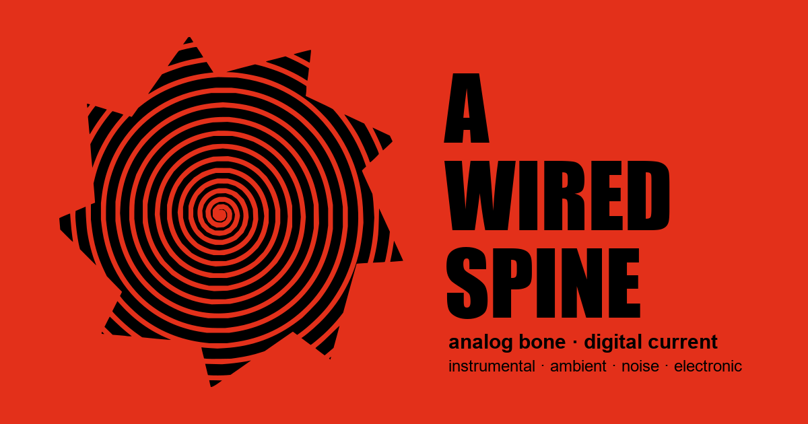

<div align="center">
  

  <br><br>

  <p>
    <em>Single-page site for an experimental electronic music project.</em><br>
    Three self-released records on SoundCloud &nbsp;·&nbsp; recorded 2004 – 2012 in FL Studio.
  </p>

  <p>
    
    
    
    
  </p>

  <p>
    <a href="https://soundcloud.com/awiredspine"><b>soundcloud.com/awiredspine</b></a>
  </p>
</div>

<br>

> _A body plugged in — analog inspiration carried on a digital signal._

<br>

## Overview

Three records, one page, zero framework bloat.

- **INTERRUPTOR** &nbsp;·&nbsp; EP &nbsp;·&nbsp; 2006
- **PLEASE, PLEASE!!!** &nbsp;·&nbsp; Album &nbsp;·&nbsp; 2010
- **ROUTINE** &nbsp;·&nbsp; Album &nbsp;·&nbsp; 2012

Sound: electronic, instrumental, no vocals — ambient, noise, experimental, hypnotic rock. A few tracks use short cassette recordings (rain, steps, water, cars at night) as texture.

<br>

---

## Stack

| Layer        | Choice                                                        |
| ------------ | ------------------------------------------------------------- |
| Framework    | [Jaspr](https://docs.jaspr.site) (Dart, static rendering)     |
| Styling      | Plain CSS in `web/style.css` — no utility framework           |
| Interactive  | Plain JS (`hero.js`, `app.js`) — no runtime dependency        |
| Typography   | Archivo Black · Space Mono · EB Garamond · Major Mono Display |
| Logo         | PNG → SVG via [potrace](https://potrace.sourceforge.net/)     |
| Hero visual  | `<canvas>` moiré ring field, pure CSS vignette + scanlines    |

<br>

## Project layout

```
lib/
├─ app.dart              full page as one StatelessComponent
├─ main.server.dart      Document, <head>, asset links
└─ main.client.dart      client hydration entry

web/
├─ style.css             all visual styling
├─ hero.js               canvas ring field + moiré
├─ app.js                release list, clock, crosshair, parallax
└─ assets/
   ├─ spine-logo.svg     vectorized logo (no fill — color via CSS)
   └─ spine-logo.png     original raster source
```

<br>

## Commands

```bash
dart pub get                    # install deps
dart run jaspr serve            # dev server with hot reload
dart run jaspr build            # static output → build/jaspr/
dart analyze                    # lints
dart format --line-length 120 . # format
```

Install the CLI once:

```bash
dart pub global activate jaspr_cli
```

<br>

---

## Design tokens

```css
--bg:        #000000      /* page */
--ink:       #F2EFE6      /* primary text */
--ink-dim:   #8A8880      /* secondary text */
--acid:      #E3301A      /* single accent — blood red */
--line:      rgba(242, 239, 230, 0.18)
```

| Role       | Family               | Weight       |
| ---------- | -------------------- | ------------ |
| Display    | Archivo Black        | 400          |
| Body mono  | Space Mono           | 400 / 700    |
| Prose      | EB Garamond          | 400 / 500 i  |
| Caps label | Major Mono Display   | 400          |

<br>

## Sections

1. **Hero** — full-bleed canvas op-art (concentric rings, radial spokes, counter-rotating moiré), spinning spine logo, glitched `A WIRED SPINE` title, corner tags
2. **Interlude** — three-row marquee (records · genres · wordmark), alternating bands
3. **Catalog** — three release rows; click unspools a SoundCloud iframe inline
4. **Etymology** — anatomical-plate layout explaining **SPINE** (analog · human · inspiration) and **WIRED** (electronic · digital · signal)
5. **Signal** — transmission-log readout + primary SoundCloud channel card
6. **Footer** — spinning spiral + marquee coda

<br>

## Regenerating the logo

The SVG in `web/assets/spine-logo.svg` is a vector trace of the original PNG.

```bash
pip install potracer pillow numpy
```

Trace parameters:

| Parameter  | Value         | Why                                              |
| ---------- | ------------- | ------------------------------------------------ |
| Threshold  | `arr > 128`   | Preserves original polarity on a dark page       |
| `alphamax` | `0.4`         | Keeps the starburst tips sharp                   |
| `turdsize` | `4`           | Drops specks, keeps fine rings                   |
| Corner filter | bbox test  | Removes only subpaths hugging an image corner    |

The SVG has **no `fill` attribute** — color is applied at the consumer via CSS `filter: brightness(0) invert(1)` (white ink on dark) or `mask-image` (for the red topbar mark).

<br>

---

<div align="center">
  <sub>
    Music & art direction: Rafael Camargo (A Wired Spine).<br>
    Page built with Claude.
  </sub>
</div>
